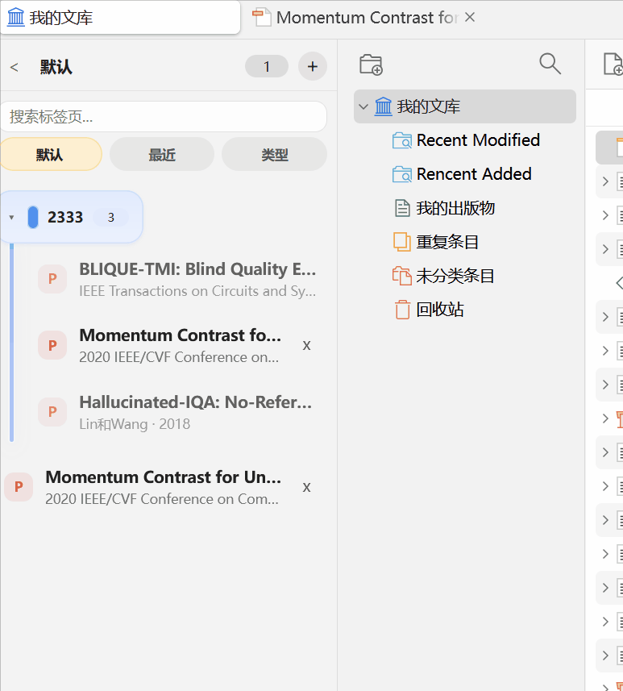
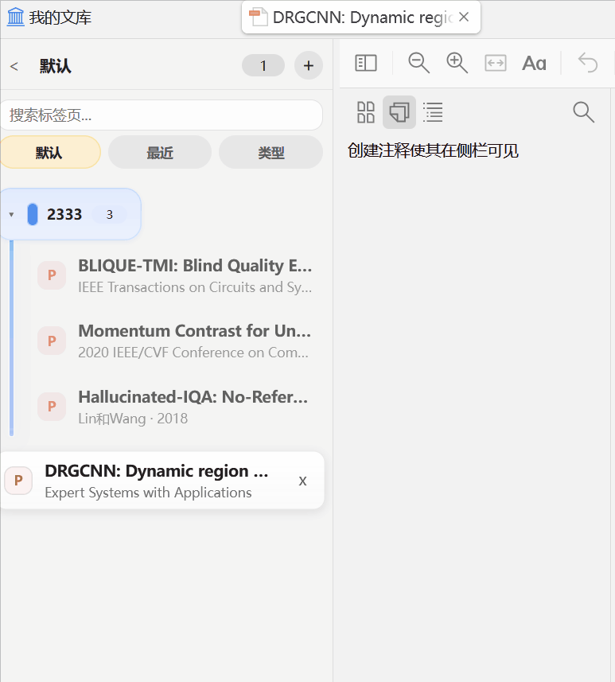
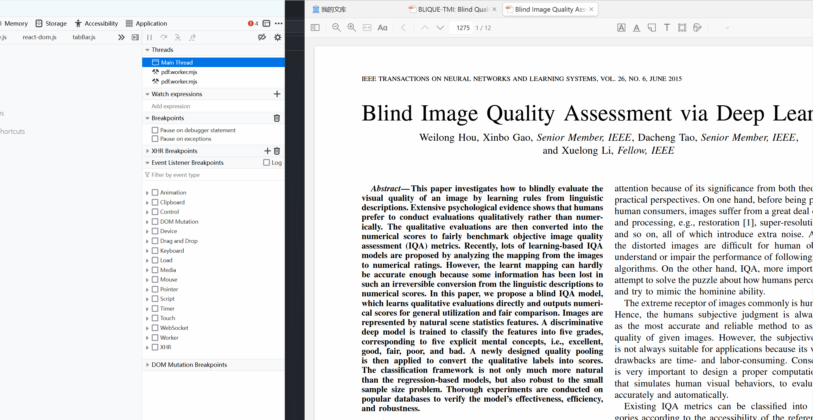
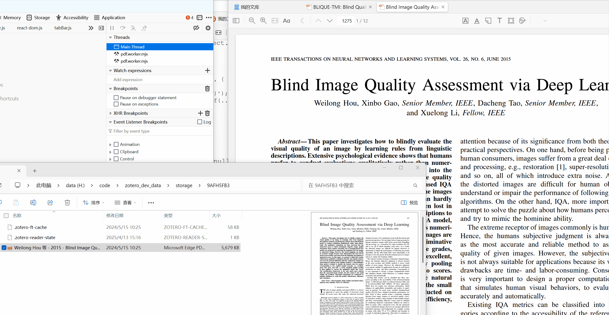
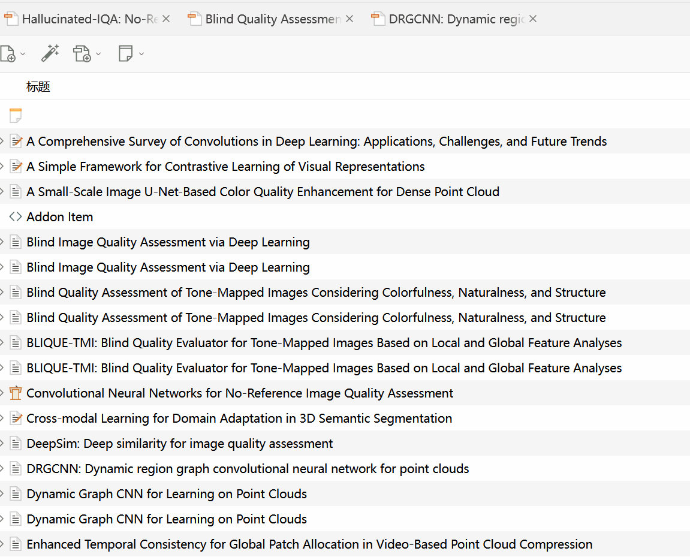

# Tab Enhance for Zotero

[简体中文](../README.md) | English

Tab Enhance is a Zotero plugin that adds more convenient tab-related features to Zotero.

## Main Features

### Enhanced context menu for horizontal tabs
- **Show in Filesystem**: Right-click a document tab to quickly locate the current document in the file system, avoiding the extra jump from the Zotero item to the file manager.
- **Reload Tab**: Right-click a document tab to reload it, which is useful when you want to reflect changes made by an external editor.
- **Copy Citation**: Right-click a document tab to copy the citation of the corresponding paper. The citation format follows the user's Zotero settings.

### Sidebar
- **Vertical Tabs**: Show tabs in a sidebar for easier switching across many open tabs.
- **Tab Grouping**: Organize related tabs into groups.
- **Tab Search**: Search tabs quickly from the sidebar.

## Installation

1. Download the latest `.xpi` file from the [Releases page](https://github.com/Rphone/zotero-tab-enhance/releases)
2. In Zotero, choose `Tools -> Add-ons -> ⚙️ -> Install Add-on From File`, then select the downloaded XPI file

## Compatibility

- Requires Zotero 7.0 or later
- Compatible with Zotero 7.0-7.1.*

## Features

### Tab Sidebar
Adds a sidebar to Zotero that automatically synchronizes with native tabs and provides grouping, search, and related management features.  
Closing a tab does not remove it from the sidebar. Instead, it is marked as closed, making it easier to manage and restore later.

#### Screenshot

### Tab Grouping and Management
Provides grouping for tabs in the sidebar, so related tabs can be placed into the same group for easier management and switching.  
Groups support both expand and collapse states, allowing users to adjust the interface as needed.  
Note: groups stay pinned at the top of the sidebar.

#### Screenshot

### Show in File Manager

1. Open a PDF or other document in Zotero
2. Right-click the document tab
3. Choose `Show in File Manager`

#### Screenshot

### Reload Tab

1. Open a PDF or other document in Zotero
2. Right-click the document tab
3. Choose `Reload Tab`

#### Screenshot

### Copy Citation

1. Open a PDF or other document in Zotero
2. Right-click the document tab
3. Choose `Copy Citation to Clipboard`
4. The citation format follows the configuration in `Edit -> Preferences -> Export`

#### Screenshot

## Acknowledgements and Feedback

Thanks to [Zotero-plugin-template](https://github.com/windingwind/zotero-plugin-template) for providing the plugin development template, which greatly simplified the development workflow.

Thanks to [Ethereal Style](https://github.com/MuiseDestiny/zotero-style) and this [bilibili video](https://www.bilibili.com/video/BV1rwcBzbEVG/) for demonstrating and explaining the sidebar implementation ideas. If you find that project useful, consider supporting the author via their Pro membership.

Microsoft Edge tab grouping also provided useful visual design inspiration for the grouping feature in this plugin.

I am not an experienced JS/TS or Zotero developer, so the plugin may still contain bugs. The code was written and refined with AI assistance, but issues may still exist. If you encounter any problems or have suggestions for improvement, feel free to open an [Issue](https://github.com/Rphone/zotero-tab-enhance/issues).

## License

This project is released under the [AGPLv3](https://www.gnu.org/licenses/agpl-3.0.html) license.
